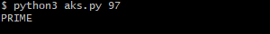

# CSC498 Research Project: AKS Primality Test
This is my research project for CSC498 at UTM. My project topic is showing that the AKS Primality Test is in P. So this repository contains my implementation of the AKS algorithm in Python, which is aks.py. If you want to see my report, check out aks_report.pdf, which further explains in detail everything you need to know about the AKS Primality Test. It also contains my references for my research.

My job is to learn the AKS Primality Test algorithm, and convert my findings into a format (research paper) that is accessible to computer science students at any level.

## Goals of this project ##
1. A computer science student at any level can understand what the AKS Primality Test is, and the reasoning behind its logic
2. To show that the AKS Primality Test is in P

## Implementation ##
I implemented this algorithm in Python[^1], and also created some scripts in Bash to test its performance (see section Performance testing below for more).

aks.py also contains documentation I wrote, using Python docstrings.

### Instructions on how to run aks.py ###

1. First, open up a command line like Git Bash, and after cloning the project, make sure you are inside the project directory (in CSC498_AKS). Or, see below commands for how to do this (run these on the command line).

       git clone https://github.com/rayhanFazal/CSC498_AKS.git # cloning repository
       cd CSC498_AKS/ # navigate to project directory

3. Now, you can run aks.py:

       python3 aks.py n

**Input**: n, which must be a positive integer greater than 1.

**Output**: "PRIME" if n is a prime number, "COMPOSITE" if n is a composite number.

Example run (I ran this in a Git Bash terminal):

## Performance testing ##
To test the runtime of aks.py, there are 2 scripts: testPerformance and plotruntimes.

testPerformance runs the aks.py program from 1 to $INPUT_NUM, where $INPUT_NUM is how many numbers you want to test aks.py on, and records the runtime in a file called runtimes.tsv (see testPerformance file for more). The format of runtimes.tsv is as follows:

    Input [3 spaces]  Execution time (secs)

plotruntimes plots the results from runtimes.tsv onto a graph using gnuplot. The x-axis represents the input that we ran on aks.py, and the y-axis represents the execution time for that specific input on aks.py.
Currently, we plot execution time in seconds on the graph, since nanoseconds can output numbers that are very large and so it might throw an error for some computers. Hence, if you want to see the runtime in nanoseconds, it is best to run these tests on a DH Lab PC. Also, since plotruntimes uses gnuplot to make the graph, it probably is better to just run all the code here in this whole project on a DH Lab PC, to save you the hassle of having to download gnuplot. See plotruntimes file for more.

### How to run the performance tests ###
Run the following two commands below in the order they appear:

    ./testPerformance
    ./plotruntimes
(If you are running these commands on a DH Lab PC and you get a permission error, just run the following command below[^2], and then you should be able to run the 2 scripts above):

    chmod +x testPerformance plotruntimes
Now, you should be able to view the graph called "runtimes_graph.png".

Also, another way you can test the runtime of aks.py is by using the "time" command. 

Example (run this on the command line):

    time python3 aks.py 107

[^1]: log base 2 is used is used in this implementation. Also, my performance testing code uses gnuplot to create the graph, so to test my entire project implementation, it would be best for you to run my entire code in a DH Lab PC to save you the hassle of having to download gnuplot. See section Performance testing in this README for more.

[^2]: This command allows anyone to run the file(s) listed after it, in this case the files are testPerformance and plotruntimes.

